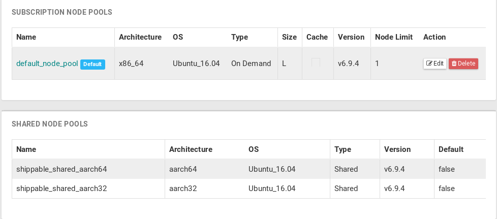

[](https://travis-ci.org/junaruga/ci-multi-arch-test)
[](https://app.shippable.com/github/junaruga/ci-multi-arch-test/runs?branchName=master)

# ci-multi-arch-test

## Travis CI

Using QEMU and Docker container. [1][2][3]

```
$ docker run --rm --privileged multiarch/qemu-user-static:register --reset

$ docker run --rm -t multiarch/ubuntu-debootstrap:arm64-bionic uname -a
Linux 28c784e9c7bc 4.4.0-101-generic #124~14.04.1-Ubuntu SMP Fri Nov 10 19:05:36 UTC 2017 aarch64 aarch64 aarch64 GNU/Linux

$ docker run --rm -t multiarch/ubuntu-debootstrap:armhf-bionic uname -a
Linux 4de7b4e919b0 4.4.0-101-generic #124~14.04.1-Ubuntu SMP Fri Nov 10 19:05:36 UTC 2017 armv7l armv7l armv7l GNU/Linux

$ docker run --rm -t multiarch/debian-debootstrap:s390x-jessie uname -a
Linux e774bfd6a08e 4.13.0-1008-gcp #11-Ubuntu SMP Thu Jan 25 11:08:44 UTC 2018 s390x GNU/Linux
```

## Shippalbe

Node pools available for free.



## References

* [1] multiarch: https://github.com/multiarch/qemu-user-static
* [2] multiarch Ubuntu: https://hub.docker.com/r/multiarch/ubuntu-debootstrap/tags/
* [3] multiarch Debian: https://hub.docker.com/r/multiarch/debian-debootstrap/tags/
* [4] multiarch CentOS: https://hub.docker.com/r/multiarch/centos/tags/
* [5] multiarch Fedora: https://hub.docker.com/r/multiarch/fedora/tags/
